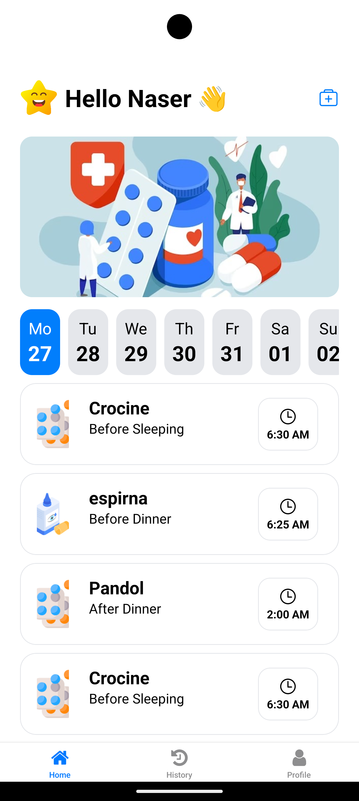

#  💊 Easy Meds: Your Friendly Medication Reminder App




<h3 align="center">Take control of your health and never miss a dose again!</h3>


**Easy Meds** is a React Native mobile application built with Expo, designed to help you effortlessly manage and track your medications. 

Never miss a dose again with our intuitive interface, customizable reminders, and detailed history tracking!

## 💖 Support & Donations

If you find Easy Meds helpful and would like to support its development, you can make a donation:

- **PayPal**: [mnasserone@gmail.com](mailto:mnasserone@gmail.com)

Your support is greatly appreciated and helps us continue to improve and maintain the project.

## ✨ Features

*   **Medication Management:**
    *   ➕ Easily add new medications with details like name, type (tablet, capsule, etc.), dosage, and frequency.
    *   📅 Set start and end dates for your medication regimen.
    *   ⏰ Configure personalized reminders to take your meds at the right time.
*   **History Tracking:**
    *   🗂️ View a clear history of your medication intake, organized by date.
    *   ✅ See the status of each dose (Taken, Missed).
    *   🔍 Filter your medication history by specific dates.
*   **User Authentication:**
    *   🔐 Securely sign up and sign in using your email and password.
    *   👤 Manage your profile.
*   **Intuitive UI:**
    *   🎨 Clean and user-friendly design for a seamless experience.
    *   📱 Built with React Native for a native look and feel on both iOS and Android.
*   **Customizable:**
    *   ⚙️ Choose from a variety of medication types and reminder frequencies.

## 🚀 Getting Started

### Prerequisites

*   **Node.js:** Make sure you have Node.js installed on your system.
*   **npm or Yarn:** We recommend using npm, but Yarn works as well.
*   **Expo CLI:** Install the Expo CLI globally:

    ```bash
    npm install -g expo-cli
    ```

### Installation

1. **Clone the repository:**

    ```bash
    git clone https://github.com/nasserml/easy-meds-react-native-app.git
    cd easy-meds-react-native-app
    ```

2. **Install dependencies:**

    ```bash
    npm install
    ```

### Running the App

1. **Firebase Setup:**
    *   Create a Firebase project in the Firebase console.
    *   Enable Email/Password authentication in the "Authentication" section.
    *   Enable Cloud Firestore database.
    *   Copy your Firebase config (apiKey, authDomain, etc.) into `config/FirebaseConfig.jsx`.
    *   Add a `.env` file in the root with the content:

        ```
        EXPO_PUBLIC_FIREBASE_API_KEY=YOUR_API_KEY
        ```

2. **Start the development server:**

    ```bash
    npx expo start
    ```

3. **Open the app:**
    *   **Simulator/Emulator:** Press `i` to open in an iOS simulator or `a` for an Android emulator (make sure they are installed and running).
    *   **Expo Go:** Scan the QR code with the Expo Go app on your physical device.
                          |

## 📁 Project Structure

Here's a breakdown of the key files and directories in the Easy Meds project:

```
easy-meds-react-native-app-main/
├── app/
│   ├── (tabs)/          # Main tab navigation screens
│   │   ├── index.jsx       # Home screen (medication list) 🏠
│   │   ├── History.jsx     # Medication history screen 📅
│   │   ├── Profile.jsx     # User profile screen 👤
│   │   └── _layout.jsx     # Tab navigation layout  ট্যাಬ್
│   ├── action-modal/   # Medication action modal (Taken/Missed)
│   │   └── index.jsx       # Modal for marking medication status ✅❌
│   ├── add-new-medication/ # Screen to add a new medication
│   │   └── index.jsx       # Form for adding a new medication ➕
│   ├── login/          # Login and signup screens
│   │   ├── index.jsx       # Initial login screen with intro 🔑
│   │   ├── signIn.jsx      # Sign-in form ➡️
│   │   └── signUp.jsx      # Sign-up form ➕
│   ├── _layout.tsx     # Main app layout (stack navigation) 📱
│   └── app.json        # Expo app configuration
├── components/         # Reusable UI components
│   ├── AddMedicationForm.jsx   # Form component for adding meds 📝
│   ├── AddMedicationHeader.jsx # Header for the add medication screen ➕
│   ├── EmptyState.jsx          # Displayed when no medications are found 🚫
│   ├── Header.jsx              # App header with user greeting 👋
│   ├── MedicationCardItem.jsx  # Card to display individual medication details 💊
│   └── MedicationList.jsx      # List component for displaying medications 📋
├── config/             # Configuration files
│   └── FirebaseConfig.jsx      # Firebase setup and initialization 🔥
├── constant/           # Constants used throughout the app
│   ├── Colors.jsx          # Color definitions 🎨
│   ├── ConstantString.jsx  # Reusable text strings 🔤
│   └── Options.jsx         # Medication types and reminder options ⚙️
├── service/            # Utility services
│   ├── ConvertDateTime.jsx # Date and time formatting functions 📅⏰
│   └── Storage.jsx         # Local storage (AsyncStorage) helper functions 💾
├── package.json        # Project dependencies and scripts
├── README.md           # You are here!
├── eas.json            # EAS (Expo Application Services) build config
└── tsconfig.json       # TypeScript configuration
```

## 💻 Code Explanation

Let's dive into some of the key code files:

### `app/(tabs)/History.jsx`

This file handles the **Medication History** screen.

*   Fetches the user's medication history from Firestore based on the selected date.
*   Displays a horizontal list of the past 7 days for date filtering.
*   Renders a `MedicationCardItem` for each medication taken on the selected date.
*   Shows an appropriate message if no medications are found for the selected date.
*   **Tech:** `React`, `React Native`, `expo-router`, `Firebase Firestore`, `moment`

### `app/(tabs)/index.jsx`

This is the **Home Screen**, which displays the user's medication list for the current day.

*   Fetches the medication list for the currently selected date from Firestore.
*   Uses `MedicationList` component to render the medications.
*   Shows the `EmptyState` component if no medications are scheduled for the day.
*   **Tech:** `React`, `React Native`, `expo-router`, `Firebase Firestore`

### `app/(tabs)/_layout.jsx`

This file defines the **tab navigation** structure using `expo-router`.

*   Sets up three tabs: Home, History, and Profile.
*   Uses `FontAwesome` icons for the tab bar.
*   **Tech:** `React`, `expo-router`, `@expo/vector-icons`

### `app/action-modal/index.jsx`

This component is a **modal** that appears when the user taps on a medication in the list.

*   Allows the user to mark a medication as "Taken" or "Missed."
*   Updates the medication's `action` array in Firestore with the status, timestamp, and date.
*   **Tech:** `React`, `React Native`, `expo-router`, `Firebase Firestore`, `moment`

### `app/add-new-medication/index.jsx`

This screen contains the form for **adding a new medication**.

*   Uses the `AddMedicationForm` and `AddMedicationHeader` components.
*   **Tech:** `React`, `React Native`

### `app/login/index.jsx`, `signIn.jsx`, `signUp.jsx`

These files handle the **user authentication** flow.

*   `index.jsx`: The initial screen with a welcome message and a button to continue.
*   `signIn.jsx`: The sign-in form using email and password.
*   `signUp.jsx`: The sign-up form for new users.
*   Uses Firebase Authentication for secure user management.
*   **Tech:** `React`, `React Native`, `expo-router`, `Firebase Authentication`

### `components/`

This directory contains reusable UI components:

*   `AddMedicationForm.jsx`: The form for adding new medications (input fields, date pickers, etc.).
*   `AddMedicationHeader.jsx`: A header component specifically for the "Add Medication" screen.
*   `EmptyState.jsx`: A component displayed when there are no medications to show.
*   `Header.jsx`: The main header of the app, which greets the user.
*   `MedicationCardItem.jsx`: A card component that displays the details of a single medication.
*   `MedicationList.jsx`: A component that renders a list of `MedicationCardItem` components.

### `config/FirebaseConfig.jsx`

This file initializes the **Firebase** app and exports the `auth` and `db` objects for use throughout the project.

### `constant/`

This directory contains constant values used in the app:

*   `Colors.jsx`: Defines the color palette.
*   `ConstantString.jsx`: Stores reusable text strings (e.g., for empty state messages).
*   `Options.jsx`: Provides options for medication types (tablet, capsule, etc.) and reminder frequencies.

### `service/`

This directory contains utility services:

*   `ConvertDateTime.jsx`: Helper functions for formatting dates and times using `moment`.
*   `Storage.jsx`: Functions for interacting with local storage (using `AsyncStorage`).

## 🤝 Contributing

Contributions are welcome! If you find a bug or want to add a new feature, please feel free to open an issue or submit a pull request.

## 📄 License

This project is licensed under the MIT License - see the [LICENSE](LICENSE) file for details (if you added a license to your project). If you haven't added one, consider doing so.

## 🙏 Acknowledgments

*   [Youtube-Tutorial](https://www.youtube.com/watch?v=2ua_Eu0LhcI&t=4s)
*   [Expo](https://expo.dev)
*   [React Native](https://reactnative.dev)
*   [Firebase](https://firebase.google.com)
*   [Moment.js](https://momentjs.com)
*   [React Native Vector Icons](https://github.com/oblador/react-native-vector-icons)

---

❤️ Happy coding, and stay healthy!
